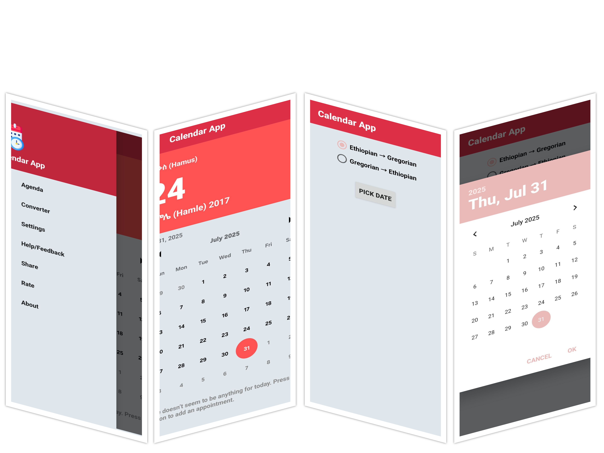

# Calender (Android — Java)

> Offline **date converter** for Android built with **Java** in **Android Studio**. Converts **Ethiopian (ፊደል / Geʽez) ⇄ Gregorian** dates, shows today in both calendars, and includes simple pickers.

---

## ✨ Features

- 🇪🇹 **Ethiopian → Gregorian** conversion
- 🌍 **Gregorian → Ethiopian** conversion
- 🗓️ “Today” in both calendars (Africa/Addis_Ababa awareness)
- 📅 Simple date pickers (or manual input)
- 🌙 Optional dark theme & Amharic UI strings

---
[⬇️ Download the APK](https://github.com/alazar80/Calender/raw/main/Calender.apk)
---

## 🧱 Tech Stack

- **Android Studio** (Gradle Wrapper)
- **Java** (Android SDK)
- No network required (pure math, **Julian Day Number** method)
- UI: AppCompat/Material, `ViewBinding`/`RecyclerView` (if used)

---

---

## 🚀 Quick Start

1. **Clone**
   ```bash
   git clone https://github.com/alazar80/Calender.git
   cd Calender
